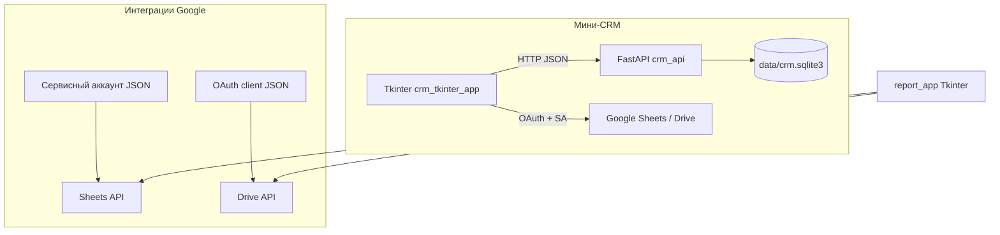

# Проект: Google-интеграции и мини-CRM

Репозиторий объединяет **два направления**:

1. **Интеграция с Google** — работа с **Google Sheets** (сервисный аккаунт) и **Google Drive** (OAuth2 пользователя): CRUD, генерация отчётов, создание таблиц в папке пользователя.
2. **Мини-CRM** — локальная **SQLite**-база, **REST API на FastAPI** и **десктоп-клиент на Tkinter**, с выгрузкой таблиц в Google Sheets из GUI.

Ниже — представлена документация: как устроены части, как их запускать и как они связаны.

---

## Содержание

- [Архитектура](#архитектура)
- [Структура каталогов](#структура-каталогов)
- [Требования и установка](#требования-и-установка)
- [Переменные окружения (.env)](#переменные-окружения-env)
- [Docker: API в контейнере](#docker-api-в-контейнере)
- [Модуль Google Sheets](#модуль-google-sheets)
- [Модуль Google Drive](#модуль-google-drive)
- [Симулятор отчётов (Tkinter + Sheets)](#симулятор-отчётов-tkinter--sheets)
- [Мини-CRM: база, API, GUI](#мини-crm-база-api-gui)
- [Скрипты тестовых данных](#скрипты-тестовых-данных)
- [Запуск: шпаргалка](#запуск-шпаргалка)
- [Устранение неполадок](#устранение-неполадок)

---

## Архитектура



**Идея CRM-GUI:** пользователь работает под своим Google-аккаунтом через **OAuth** (создаёт файл таблицы на Drive), а запись ячеек и форматирование выполняет **сервисный аккаунт** по **Sheets API**. Поэтому email сервисного аккаунта (`client_email` в JSON ключа) нужно добавить в роли **редактор** на папку отчётов (или на конкретные файлы), иначе запись после создания файла может завершиться ошибкой доступа.

---

## Структура каталогов

| Путь | Назначение |
|------|------------|
| `src/backend/crm_db.py` | Класс `CRMDatabase`: SQLite, создание таблиц, CRUD, поиск |
| `src/backend/crm_logging.py` | Настройка логирования: уровень из `LOG_LEVEL` в `.env` |
| `src/backend/crm_admin.py` | Очистка БД и заполнение тестовыми данными (скрипты и админ-API) |
| `src/backend/crm_api.py` | FastAPI-приложение, REST-endpoints |
| `src/ui/crm_tkinter_app.py` | Клиент CRM: вкладки, запросы к API, настройки Google, выгрузка отчётов |
| `src/ui/crm_google_export.py` | Сборка аналитики, сетки листа и вызов `GoogleDriveClient` + `GoogleSheetsClient` |
| `src/integrations/google_sheets.py` | `GoogleSheetsClient`: Sheets API, сервисный аккаунт |
| `src/integrations/google_drive.py` | `GoogleDriveClient`: Drive API, OAuth2, создание файлов в папке |
| `src/integrations/report_generator.py` | Демо-отчёты (случайные данные), форматирование листа |
| `src/integrations/report_app.py` | Tkinter: период, подразделение, тип отчёта → новый лист в книге |
| `data/crm.sqlite3` | Файл БД CRM (создаётся при работе API/скриптов) |
| `scripts/seed_crm_db.py` | Наполнение БД тестовыми данными |
| `scripts/clear_crm_db.py` | Полная очистка таблиц и сброс `sqlite_sequence` |
| `.env` / `.env.example` | Секреты и ID (не коммитить `.env` с реальными ключами) |
| `requirements.txt` | Зависимости Python |
| `Dockerfile` / `docker-compose.yml` | Сборка и запуск только **API** CRM в контейнере |

Весь прикладной код лежит под `src/`.

---

## Требования и установка

- **Python 3.10+**
- Учётная запись **Google** и проект в **Google Cloud Console**
- Для Sheets: **сервисный аккаунт** и включённый **Google Sheets API**
- Для Drive и OAuth-потока в GUI: **OAuth Client** (Desktop) и включённый **Google Drive API**
- Таблицы — нативные **Google Sheets** (не «только Excel на Диске»)

```bash
cd google_sheet_integration
python3 -m venv .venv
source .venv/bin/activate   # Windows: .venv\Scripts\activate
pip install -r requirements.txt
cp .env.example .env
# отредактируйте .env
```

---

## Переменные окружения (.env)

Файл **`.env`** в **корне репозитория** подхватывается через `python-dotenv` (интеграции Google, API, GUI, скрипты) и при `docker compose` — через директиву `env_file` (см. раздел [Docker](#docker-api-в-контейнере)). Шаблон значений: **`.env.example`** — скопируйте в `.env` и заполните.

### Таблица переменных

| Переменная | Где используется | Описание |
|------------|------------------|----------|
| `CREDENTIALS_PATH` | `google_sheets.py`, CRM GUI | Путь к JSON **сервисного аккаунта** Google (имя файла относительно корня проекта или **абсолютный** путь). Нужен для Sheets API и для записи в таблицы, созданные из GUI. |
| `SPREADSHEET_ID` | `google_sheets.py`, симулятор `report_app` | ID **книги** из URL: `https://docs.google.com/spreadsheets/d/<SPREADSHEET_ID>/edit` — куда симулятор отчётов добавляет новые листы. |
| `CREDENTIALS_CLIENT_PATH` | `google_drive.py`, CRM GUI | JSON **OAuth 2.0 Client** типа Desktop (или совместимый) для входа пользователя в Drive. |
| `REPORT_FOLDER_ID` | `google_drive.py`, CRM GUI | ID **папки** на Drive: `https://drive.google.com/drive/folders/<ID>` — туда OAuth создаёт новые таблицы при выгрузке из CRM. |
| `TOKEN_PATH` | `google_drive.py` (опционально) | Файл сохранённого **токена OAuth** после первого входа. По умолчанию логика клиента ориентируется на имя вроде `token_drive.json`; при необходимости задайте абсолютный путь (удобно в Docker, если токен лежит в томе). |
| `LOG_LEVEL` | `crm_logging.setup_logging`, API, GUI, скрипты | Уровень журналирования: **`DEBUG`**, **`INFO`**, **`WARNING`**, **`ERROR`**, **`CRITICAL`**. Управляет подробностью логов uvicorn/fastapi и сообщений приложения. Для разбирательств с запросами выставите **`DEBUG`**. |
| `CRM_DB_PATH` | `crm_api.py`, скрипты `clear`/`seed` при запуске с путём по умолчанию | Путь к файлу **SQLite** CRM. Локально часто `data/crm.sqlite3` (относительно корня); **в Docker Compose** переменная **переопределяется** на `/app/data/crm.sqlite3`, чтобы БД всегда лежала в смонтированном каталоге. |
| `CRM_ALLOW_ADMIN_ENDPOINTS` | `crm_api.py` | Если **`true`** / **`1`** / **`yes`** / **`on`** — доступны опасные эндпоинты очистки и заполнения БД (ниже). В **продакшене** держите **`false`**, чтобы скрыть `POST /admin/*` (ответ **404**). |
| `CRM_HOST_PORT` | только `docker-compose.yml` | Порт **на хосте**, который пробрасывается на **8000** внутри контейнера. Пример: `CRM_HOST_PORT=8080` → API по адресу `http://127.0.0.1:8080`. Не читается приложением Python напрямую. |
| `CRM_SECRETS_DIR` | только `docker-compose.yml` | Каталог на хосте с JSON-ключами, монтируется в контейнер как **`/app/secrets`** (read-only). По умолчанию **`./secrets`**. В `.env` внутри контейнера укажите пути вида `/app/secrets/service-account.json`. |

### Админ-эндпоинты API (когда `CRM_ALLOW_ADMIN_ENDPOINTS` включён)

| Метод и путь | Назначение |
|--------------|------------|
| `POST /admin/clear-database` | Удаляет все строки из таблиц CRM и сбрасывает `sqlite_sequence` (та же семантика, что у `scripts/clear_crm_db.py` для текущего `CRM_DB_PATH`). |
| `POST /admin/seed-test-data` | Добавляет фиксированный набор тестовых данных (как `scripts/seed_crm_db.py`). Обычно перед этим вызывают **clear**, иначе строки **дописываются** к уже существующим. |

Пример вызова с хоста (порт по умолчанию 8000):

```bash
curl -X POST http://127.0.0.1:8000/admin/clear-database
curl -X POST http://127.0.0.1:8000/admin/seed-test-data
```

Токен пользователя Drive после первого успешного OAuth обычно сохраняется в **`token_drive.json`** (или по пути **`TOKEN_PATH`**). Файл появляется на той машине, где выполнялся вход в браузер (для GUI — на вашем ПК).

В **CRM Tkinter** пути Google и `REPORT_FOLDER_ID` можно менять в окне **«Настройки Google»** и записывать в `.env` (кнопка «Сохранить в .env»). Там же есть краткая справка по настройке доступов в **Google Cloud Console**.

### Пример фрагмента `.env` с комментариями

```env
# --- Google (Sheets + Drive) ---
CREDENTIALS_PATH=my-service-account.json
SPREADSHEET_ID=ваш_id_книги
CREDENTIALS_CLIENT_PATH=client_secret.json
REPORT_FOLDER_ID=ваш_id_папки_на_drive

# --- Журналирование и БД ---
LOG_LEVEL=INFO
CRM_DB_PATH=data/crm.sqlite3

# Только для локальной разработки / Docker: POST /admin/clear-database и /admin/seed-test-data
CRM_ALLOW_ADMIN_ENDPOINTS=false

# Необязательно: явный путь к токену OAuth Drive
# TOKEN_PATH=token_drive.json

# --- Вариант для Docker: ключи лежат в примонтированном ./secrets ---
# CREDENTIALS_PATH=/app/secrets/service-account.json
# CREDENTIALS_CLIENT_PATH=/app/secrets/client_secret.json
```

---

## Docker: API в контейнере

В контейнере запускается **только HTTP API** (`uvicorn` → `src.backend.crm_api:app`). **Десктоп-GUI на Tkinter в образ не входит**: его по-прежнему запускают на хосте (или другой машине в сети), указав URL API в поле **Backend URL**.

### Что делает Compose

- **Сборка** образа из `Dockerfile` (Python 3.11, зависимости из `requirements.txt`).
- Проброс порта **`${CRM_HOST_PORT:-8000}:8000`** — на хосте по умолчанию **http://127.0.0.1:8000**.
- Том **`./data` → `/app/data`** — файл **`crm.sqlite3`** хранится на хосте и **сохраняется** между перезапусками контейнера.
- Том **`${CRM_SECRETS_DIR:-./secrets}:/app/secrets:ro`** — каталог с JSON-ключами **только для чтения** внутри контейнера (если API когда-нибудь понадобится к Google из контейнера; для чистого CRM API это опционально).
- В `docker-compose.yml` задано **`CRM_DB_PATH=/app/data/crm.sqlite3`**, чтобы БД в контейнере всегда указывала на смонтированный каталог (значение **`CRM_DB_PATH` из `.env` для процесса в контейнере переопределяется** этой строкой).

Файл **`.env`** в корне проекта подключается как **`env_file`** у сервиса: в контейнер попадают `LOG_LEVEL`, флаги админ-эндпоинтов и т.д. При необходимости добавьте в `.env` пути к секретам в формате `/app/secrets/...` (см. пример в разделе про переменные).

### Подготовка

```bash
cd google_sheet_integration
cp .env.example .env
# Отредактируйте .env: LOG_LEVEL, при необходимости CRM_ALLOW_ADMIN_ENDPOINTS=true для очистки/seed по HTTP.
mkdir -p data secrets
# При желании положите копии ключей в secrets/ и пропишите CREDENTIALS_PATH=/app/secrets/... в .env
```

### Запуск в foreground (логи в текущем терминале)

```bash
docker compose up --build
```

Остановка: **Ctrl+C**. Контейнер завершится; данные в **`./data`** останутся.

### Запуск в фоне (detached)

```bash
docker compose up -d --build
```

Просмотр логов:

```bash
docker compose logs -f
```

### Корректная остановка

- Остановить контейнеры, **не** удаляя их (можно снова `docker compose start`):

  ```bash
  docker compose stop
  ```

- Остановить и **убрать** контейнеры (сеть освобождена; тома **`./data`** и **`./secrets`** на диске **сохраняются**):

  ```bash
  docker compose down
  ```

### GUI после запуска контейнера

1. Убедитесь, что API отвечает, например: `curl http://127.0.0.1:8000/health` (или другой порт, если задан `CRM_HOST_PORT`).
2. На хосте активируйте venv и запустите клиент:

   ```bash
   source .venv/bin/activate
   python src/ui/crm_tkinter_app.py
   ```

3. В окне приложения введите **Backend URL** тот же, что доступен с вашего ПК (например `http://127.0.0.1:8000`), нажмите **Подключить**.
4. Выгрузка в **Google** из GUI выполняется **локально** (ключи, OAuth, браузер на вашей машине) и **не требует** секретов внутри контейнера.

### Очистка и тестовые данные при работающем контейнере

Включите в `.env`: **`CRM_ALLOW_ADMIN_ENDPOINTS=true`** (или `1` / `yes` / `on`), перезапустите compose. Затем:

```bash
curl -X POST http://127.0.0.1:8000/admin/clear-database
curl -X POST http://127.0.0.1:8000/admin/seed-test-data
```

Альтернатива без админ-API: с хоста при **том же** файле `./data/crm.sqlite3`:

```bash
python scripts/clear_crm_db.py
python scripts/seed_crm_db.py
```

(убедитесь, что `CRM_DB_PATH` в окружении скрипта указывает на тот же файл, что и в контейнере, либо передайте путь аргументом, см. справку в скриптах).

---

## Модуль Google Sheets

Файл: `src/integrations/google_sheets.py`.

- Аутентификация: **сервисный аккаунт** (`google.oauth2.service_account`).
- Основной класс: **`GoogleSheetsClient`**: чтение листа, запись ячейки/диапазона, очистка диапазона, добавление строки, удаление строки/листа, **`add_sheet`**, **`batch_update`** (форматирование, merge, границы и т.д.).
- По умолчанию путь к ключу резолвится относительно каталога **`src/integrations/`**, если в пути только имя файла — удобнее хранить JSON в корне проекта и указать имя в `.env`.

При чтении строковых ячеек **неразрывный пробел** `\xa0` (часто из денежного формата) **убирается**.

**Проверка из консоли** (из корня проекта — читает первый лист книги из `.env`):

```bash
cd google_sheet_integration
PYTHONPATH=src/integrations python src/integrations/google_sheets.py
```

---

## Модуль Google Drive

Файл: `src/integrations/google_drive.py`.

- Аутентификация: **OAuth2** установленного приложения (`InstalledAppFlow`), область **`drive`**.
- Класс **`GoogleDriveClient`**: создание Google Sheet/Docs в папке `REPORT_FOLDER_ID`, список файлов, переименование, удаление.

Первый запуск открывает браузер для входа в аккаунт Google.

---

## Симулятор отчётов (Tkinter + Sheets)

- **`src/integrations/report_app.py`** — форма: период дат, подразделение, тип отчёта.
- **`src/integrations/report_generator.py`** — генерация случайных строк, вёрстка, **`export_report_to_sheets`**: новый лист в книге, `write_range`, `batch_update`.

Каждый запуск создаёт **новый лист** в книге с ID из `SPREADSHEET_ID`.

```bash
# из корня, при необходимости добавьте src/integrations в PYTHONPATH или запускайте из IDE
PYTHONPATH=src/integrations python src/integrations/report_app.py
```

---

## Мини-CRM: база, API, GUI

### Модель данных (SQLite)

Таблицы (см. `src/backend/crm_db.py`):

- **`managers`** — менеджеры.
- **`clients`** — клиенты (`status`: в т.ч. `ACTIVE`, `ARCHIVED`), опционально `manager_id`.
- **`deals`** — сделки (`amount`, `status`, опционально `client_id`, `manager_id`).
- **`orders`** — заказы (`total_amount`, связи с deal/client/manager).
- **`tasks`** — задачи/напоминания (`is_done`, `due_date`, связи).

Путь к файлу БД задаётся переменной **`CRM_DB_PATH`** (по умолчанию **`data/crm.sqlite3`** относительно корня проекта). В Docker Compose внутри контейнера принудительно используется **`/app/data/crm.sqlite3`** (смонтированный том).

### REST API (FastAPI)

Файл: `src/backend/crm_api.py`.

- CRUD для сущностей, поиск клиентов и сделок (`/clients/search/by-text`, `/deals/search/by-text`).
- Архив клиента: `POST /clients/{id}/archive`.
- Задачи: `POST /tasks/{id}/done` с телом `{"is_done": true/false}`.
- Ошибки целостности SQLite превращаются в **HTTP 400** (глобальный обработчик).
- При **`CRM_ALLOW_ADMIN_ENDPOINTS`** — см. таблицу админ-маршрутов в разделе [Переменные окружения](#переменные-окружения-env).

**Запуск:**

```bash
cd google_sheet_integration
uvicorn src.backend.crm_api:app --reload
```

Документация: http://127.0.0.1:8000/docs

### Клиент Tkinter

Файл: `src/ui/crm_tkinter_app.py`.

- Вкладки: менеджеры, клиенты, сделки, заказы, задачи; операции через **`requests`** к выбранному базовому URL (по умолчанию `http://127.0.0.1:8000`).
- Долгие операции (выгрузка в Google) — в **фоновом потоке**, чтобы не блокировать UI.
- **Выгрузка отчёта**: снимок текущей таблицы вкладки → блок аналитики (см. `crm_google_export.py`) + полные данные → **Drive** создаёт файл → **Sheets** пишет и форматирует. Ссылка на таблицу показывается во всплывающем окне.

**Запуск:**

```bash
cd google_sheet_integration
python src/ui/crm_tkinter_app.py
```

Нужны пакеты из `requirements.txt`, в том числе **`google-auth-oauthlib`** (импортируется `google_drive`).

---

## Скрипты тестовых данных

| Скрипт | Действие |
|--------|----------|
| `python scripts/clear_crm_db.py` | Удаляет все строки из таблиц CRM и сбрасывает **AUTOINCREMENT** (`sqlite_sequence`) |
| `python scripts/seed_crm_db.py` | Создаёт схему при отсутствии и добавляет: 5 менеджеров, 10 клиентов, 20 сделок, 50 заказов, 100 задач (суммы > 0, разные статусы) |

Путь к БД по умолчанию: **`data/crm.sqlite3`** (или значение **`CRM_DB_PATH`**). Для чистого набора: сначала `clear_crm_db`, затем `seed_crm_db`. При работающем API с включёнными админ-эндпоинтами — см. [Docker](#docker-api-в-контейнере).

---

## Запуск: шпаргалка

| Задача | Команда (из корня репозитория) |
|--------|--------------------------------|
| API CRM (локально) | `uvicorn src.backend.crm_api:app --reload` |
| API CRM (Docker, foreground) | `docker compose up --build` |
| API CRM (Docker, фон) | `docker compose up -d --build` |
| Остановить Docker | `docker compose down` или `docker compose stop` |
| GUI CRM | `python src/ui/crm_tkinter_app.py` |
| Очистить БД | `python scripts/clear_crm_db.py` |
| Заполнить тестовыми данными | `python scripts/seed_crm_db.py` |
| Симулятор отчётов Google | `PYTHONPATH=src/integrations python src/integrations/report_app.py` |

---

## Визуализация работы

В каталоге `screenshots/` находятся материалы с примерами интерфейса (например `crm_screenshots`).

## Устранение неполадок

- **403 / 404** при работе с таблицей Sheets — проверьте, что сервисному аккаунту выдан доступ **редактора** к книге, и что `SPREADSHEET_ID` полный и верный.
- **400** *This operation is not supported for this document* — файл не нативная Google Таблица; сохраните как Google Sheets.
- **Нет модуля `google_auth_oauthlib`** — установите зависимости: `pip install -r requirements.txt`, используйте то же venv, что и для запуска GUI.
- **Запись в таблицу после создания из CRM GUI падает по доступу** — добавьте `client_email` из JSON сервисного аккаунта **редактором** на папку `REPORT_FOLDER_ID` (или на файлы в ней).
- **Файл ключа не найден** — проверьте `CREDENTIALS_PATH` / `CREDENTIALS_CLIENT_PATH`: абсолютный путь или имя файла **относительно корня проекта**, если логика резолва в модуле это предполагает (см. код `Path` в клиентах).

---

## Лицензии и секреты

- Не коммить в git реальные JSON-ключи, **`token_drive.json`** и заполненный **`.env`**.
- В репозитории допустимы только шаблоны (**`.env.example`**) и при необходимости пустые/фиктивные значения.

### Публикация на GitHub

В корне проекта есть **`.gitignore`**: он исключает `.env`, типичные имена OAuth-клиентов, токены, каталог **`secrets/`**, все **`*.json` в корне репозитория** (под сервисные аккаунты и скачанные client secret), а также файлы **`data/*.sqlite3`**.

Перед первым `git push` рекомендуется:

1. Скопировать шаблон: `cp .env.example .env` и наполнить секреты **только локально** (`.env` не попадёт в git).
2. Проверить индекс: `git status` и при необходимости `git diff --cached` — не должно быть `.json` ключей, `.env`, `token_drive.json`, базы в `data/`.
3. Если ключи уже лежали в каталоге до добавления `.gitignore`, они могли быть закоммичены раньше — удалите их из истории ([`git filter-repo`](https://github.com/newren/git-filter-repo) или поддержка GitHub по очистке истории) и **ротируйте ключи** в Google Cloud (старые считать скомпрометированными).

Легитимный **`*.json` в корне** (не секрет) в `.gitignore` по умолчанию не добавляется — положите файл в подкаталог или выполните `git add -f имя.json` осознанно.
